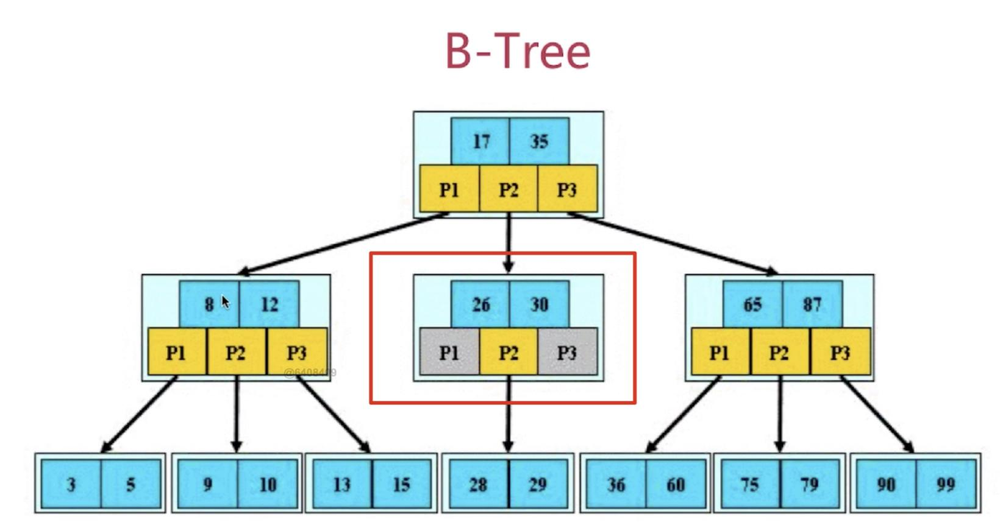

# 索引
索引(index)是帮助MySQL高效获取数据的数据结构(有序)
在数据之外,数据库系统还维护着满足特定查找算法的数据结构,这些数据结构以某种方式引用(指向)数据,这样就可以在这些数据结构上实现高级查找算法,这种数据结构就是索引

## 索引优势劣势
优势
* 类似于书籍的目录索引,提高数据检索的效率,降低数据库的IO成本
* 通过索引列对数据进行排序,降低数据排序的成本,降低CPU的消耗

劣势
* 索引实际上是一张表,该表中保存了主键与索引字段,并指向实体类的记录,索引列也要占用空间
* 虽然索引大大提高了查询效率,同时也降低更新表的速度,如对表进行INSERT,UPDATE,DELETE.因为更新表时,MySQL不仅要保存数据,还要保存一下索引文件每次更新添加了索引列的字段,都会调整因为更新所带来的键值变化后的索引信息

## 索引结构
索引是在MySQL存储引擎层中实现的,而不是在服务器层实现
MySQL提供4种索引:
* BTREE索引: 最常见的索引类型,大部分索引都支持B树索引
* HASH索引: 只有Memory引擎支持,使用场景简单
* R-tree索引(空间索引):空间索引是MyISAM引擎的一个特殊索引类型,主要用于地理空间数据类型,通常使用较少
* Full-text(全文索引): 全文索引也是MyISAM的一个特殊索引类型,主要用于全文索引,InnoDB从Mysql5.6版本开始支持全文索引

| 索引        | InnoDB引擎      | MyISAM引擎 | Memory引擎 |
| ----------- | --------------- | ---------- | ---------- |
| BTREE索引   | 支持            | 支持       | 支持       |
| HASH 索引   | 不支持          | 不支持     | 支持       |
| R-tree 索引 | 不支持          | 支持       | 不支持     |
| Full-text   | 5.6版本之后支持 | 支持       | 不支持     |

* 其中聚集索引,复合索引,前缀索引,唯一索引默认都是使用B+tree索引,统称为索引

### 索引数据结构的选型
mysql的数据文件存储在磁盘上,但又如何保障数据在磁盘上存储,效率还能比较高
首先,在数据库文件存储在磁盘时,为了提升查询效率,一定会选用合适的数据结构进行文件的存储

* 数组和链表
这种最基本的数据结构,各自的劣势太明显.
数据库对查询要求很高,所以链表这种查询必须全表遍历的基本数据结构是不能用的
数组这种结构在添加数据时成本太大,插入数据时太过于频繁

* hash
速度快,但只要是hash就会产生无序的问题,所以不常用

* 树
在查找一个数据时,二叉树是读取根节点,小则从左找,大则从右找,每次读取一个数据,没有办法合理利用局部性原理与磁盘预读,IO次数太多,其次是树的层次还是偏高,所以不合适,那每次读多个数据,每一个节点存多个数据的结构就只有B-树和B+树了

* B-树
B-树,这里的B表示`balance`(平衡),B-树是一种多路自平衡的搜索树
它类似普通的平衡二叉树,不同的一点是B-树允许每个节点有更多的子节点



B-树有如下特点:
1. 所有键值分布在整颗树中
2. 任何一个关键字出现且只出现在一个结点中
3. 搜索有可能在非叶子结点结束;
4. 在关键字全集内做一次查找,性能逼近二分查找
5. 自动控制层次

* B+树
默认是主键,如果没有主键则使用唯一索引,唯一索引也没有则使用rowid,行号.
所以一定要建立主键.

B+树是B-树的变体,也是一种多路搜索树,它与B-树的不同之处在于:
1. 所有关键字存储在叶子结点出现,内部节点(非叶子结点并不存储真正的data),只有达到叶子结点才命中
2. 为所有叶子结点增加了一个链指针

为什么使用B+树:
1. B+树更适合外部存储,由于内节点无data域,一个结点可以存储更多的内结点,每个结点能索引的范围更大更精确,也意味着B+树单次磁盘I/O的信息量大于B-树,I/O效率更高

2. MySQL是一种关系型数据库,区间访问是常见的一种情况,B+树叶结点增加的链指针,加强了区间的访问性,可使用在范围区间查询等,而B-树每个结点`key`和`data`在一起,无法区间查找


## 索引分类
* 单值索引: 即一个索引只包含单个列,一个表可以有多个单列索引
* 唯一索引: 索引列的值必须唯一,但允许有空值
* 复合索引: 即一个索引包含多个列

## 索引语法

### 创建索引
```sql
CREATE [UNIQUE|FULLTEXT|SPATIAL] INDEX index_name[USING index_type] ON tbl_name(index_col_name,...)

index_col_name: column_name[(length)][ASC|DESC]

-- 示例:
CREATE INDEX idx_city_name ON city(city_name)
```

### 查看索引
```sql
show index from table_name;
```

### 删除索引
```sql
DROP INDEX index_name ON tbl_name;
```

### ALTER命令
```sql
-- 该语句添加一个主键 必须是唯一且不能为NULL
ALTER TABLE tab_name ADD PRIMARY KEY(column_list);

-- 该语句创建索引的值必须唯一(除NULL,NULL可能会出现很多次)
ALTER TABLE tab_name ADD INDEX index_name(column_list);

-- 添加普通索引,索引值可以出现多次
ALTER TABLE tb_name ADD INDEX index_name(column_list);

-- 该语句指定索引为FULLTEXT 用于全文索引
ALTER TABLE tb_name ADD FULLTEXT index_name(column_list);
```

## 索引设计原则
* 对查询频次较高,且数据量比较大的表建立索引

* 索引字段的选择,最佳候选列应当从where子句的条件中提取,如果where子句中的组合比较多,那么应当挑选最常用,过滤效果最好的列组合

* 使用唯一索引,区分度越高,使用索引的效率越高

* 索引可以有效的提升查询数据的效率,但索引过多,会降低DML操作的效率,增加相应操作的时间消耗

* 使用短索引,假如构成索引的字段总长度比较短,那么在给定大小的存储块内可以存储更多的索引值,相应的可以有效提升MySQL访问索引的I/O效率

* 利用最左前缀,N个列组合而成的组合索引,相当于创建N个索引
```sql
-- 创建复合索引:
CREATE INDEX index_name_email_status ON tb_seller(NAME,email,STATUS);

-- 相当于:
-- 对name创建索引
-- 对name,email创建索引
-- 对name,email,status创建索引
```

