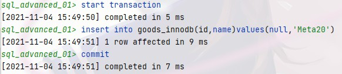
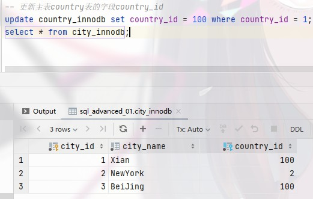
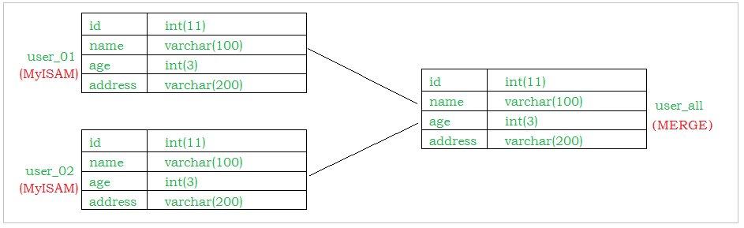

# Mysql体系结构

## 整个MySQL Server由以下组成
* Connection Pool: 连接池组件
* Management Services & Utilities: 管理服务和工具组件
* SQL Interface: SQL接口组件
* Parser: 查询分析器组件
* Optimizer: 优化器组件
* Caches & Buffers: 缓冲池组件
* Pluggable Storage Engines: 存储引擎
* File System: 文件系统

1. 连接层
 最上层是一些客户端和链接服务,包含本地sock通信和大多数基于客户端/服务端工具实现的类似于TCP/IP的通信.
 主要完成一些类似于连接处理,授权认证,以及相关的安全方案.
 
 在该层上引入线程池的概念,为通过认证安全接入的客户端提供线程.
 
 同样在该层上可以实现基于SSL的安全链接,服务器也会为安全接入的每个客户端验证它所具有的操作权限

2. 服务层
 第二层架构主要完成大多数的核心服务功能,如SQL接口,并完成缓存的查询,SQL的分析和优化,部分内置函数的执行.
 
 所有跨存储引擎的功能也在这一层实现,如过程,函数等,在该层,服务器会解析查询并创建响应的的内部解析树,并对其完成相应的优化 如确定表的查询顺序,是否利用索引等,最后生成相应的执行操作.
 
 如果是select语句,服务器还会查询内部的缓存,如果缓存空间足够大,这样在解决大量读操作的环境中能够很好的提升系统性能

3. 引擎层
 存储引擎层,存储引擎真正负责了MySQL中数据的存储和提取,服务器通过API和存储引擎进行通信.
 
 不同的存储引擎具有不同的功能,这样可以根据自己的需要,来选取合适的存储引擎.

4. 存储层
 数据存储层,主要是将数据存储在文件系统之上,并完成与存储引擎的交互

 和其他数据库相比,MySQL架构可以在多种不同场景中应用并发挥良好作用. 
 
 主要体现在存储引擎上,插件式的存储引擎架构,将查询处理和其他的系统任务以及数据的存储提取分离,这种架构可以根据业务的需求和实际需要选择合适的`存储引擎`


# 存储引擎

## 概述
 和大多数数据库不同,MySQL中有一个存储引擎的概念,针对不同的存储需求可以选择最优的存储引擎

 存储引擎就是存储数据,建立索引,更新查询数据等等技术的实现方式.存储引擎是基于表的,而不是基于库的,所以存储引擎也可被称为表类型

 Oracle,SqlServer等数据库只有一种存储引擎,MySQL提供了插件式的存储引擎架构,所以MySQL存在多种存储引擎,可以根据需要使用相应引擎,或者编写存储引擎

 MySQL5.0支持存储引擎包含:`InnoDB`,`MyISAM`,`BDB`,`MEMORY`,`EXAMPLE`,`NDB Cluster`,`ARCHIVE`,`CSV`,`BLACKHOLE`,`FEDERATED`等,其中`InnoDB`和`BDB`提供事务安全表,其他存储引擎是非事务安全表

 可以通过`show engines` ,来查询当前数据库支持的存储引擎
 ```sql
    show engines
 ```

 创建新表时如果不指定存储引擎,那么系统就会使用默认的存储引擎,MySQL5.5之前的默认存储引擎是`MylSAM`,5.5之后就改为`InnoDB`

 查看MySQL数据库默认的存储引擎,指令:
 ```sql
    show variables like '%storage_engine%';
 ```

## 各种存储引擎特性

| 特点         | InnoDB               | MyISAM   | MEMORY | MERGE | NDB  |
| ------------ | -------------------- | -------- | ------ | ----- | ---- |
| 存储限制     | 64TB                 | 有       | 有     | 没有  | 有   |
| 事务安全     | ==支持==             |          |        |       |      |
| 锁机制       | ==行锁(适合高并发)== | ==表锁== | 表锁   | 表锁  | 行锁 |
| B树索引      | 支持                 | 支持     | 支持   | 支持  | 支持 |
| 哈希索引     |                      |          | 支持   |       |      |
| 全文索引     | 支持(5.6版本之后)    | 支持     |        |       |      |
| 集群索引     | 支持                 |          |        |       |      |
| 数据索引     | 支持                 |          | 支持   |       | 支持 |
| 索引缓存     | 支持                 | 支持     | 支持   | 支持  | 支持 |
| 数据可压缩   |                      | 支持     |        |       |      |
| 空间使用     | 高                   | 低       | N/A    | 低    | 低   |
| 内存使用     | 高                   | 低       | 中等   | 低    | 高   |
| 批量插入速度 | 低                   | 高       | 高     | 高    | 高   |
| 支持外键     | ==支持==             |          |        |       |      |

### InnoDB
InnoDB存储引擎是Mysql的默认存储引擎,InnoDB存储引擎提供了具有提交,回滚,崩溃恢复能力的事务安全,但对比`MyISAM`的存储引擎,`InnoDB`写的处理效率差一些,并且会占用更多的磁盘空间以保留数据和索引

InnoDB存储引擎不同于其他存储引擎的特点:

**事务控制**
```sql
create table goods_innodb(
    id int NOT NULL AUTO_INCREMENT,
    name varchar(20) NOT NULL,
    primary key(id)
)ENGINE=innodb DEFAULT CHARSET=utf8;
```

```sql
start transaction;

insert into goods_innodb(id,name)values(null,'Meta20')

commit;
```




**外键约束**
MySQL支持外键的存储引擎只有InnoDB,在创建外键时,要求父表必须有对应的索引,子表在创建外键时,也会自动创建对应的索引.

下面两张表中,`country_innodb`是父表,`country_id`为主键索引,`city_innodb`表是子表,`country_id`字段为外键,对应于`country_innodb`表的主键`country_id`

```sql
create table country_innodb(
    country_id int NOT NULL AUTO_INCREMENT,
    country_name varchar(100) NOT NULL,
    primary key(country_id)
)ENGINE=InnoDB DEFAULT CHARSET=utf8;

create table city_innodb(
    city_id int NOT NULL AUTO_INCREMENT,
    city_name varchar(50) NOT NULL,
    country_id int NOT NULL,
    primary key(city_id),
    key idx_fk_country_id(country_id),
    CONSTRAINT `fk_city_country` FOREIGN KEY(country_id) REFERENCES
    country_innodb(country_id) ON DELETE RESTRICT ON UPDATE CASCADE
)ENGINE=InnoDB DEFAULT CHARSET=utf8

insert into country_innodb values(null,'China'),(null,'America'),(null,'Japan');
insert into city_innodb values(null,'Xian',1),(null,'NewYork',2),(null,'BeiJing',1);
```

在创建索引时,可以指定在删除,更新父表时,对子表进行相应操作,包括`RESTRICT`,`CASCADE`,`SET NULL` 和 `NO ACTION`

`RESTRICT`和`NO ACTION`相同,是指限制在子表有关记录的情况下,父表不能更新;

`CASCADE`表示父表在更新或者删除时,更新或删除子表对应的记录

`SET NULL`则表示父表在更新或删除时,子表的对应字段被`SET NULL`

针对上面创建的两个表,子表的外键指定是`ON DELETE RESTRICT` `ON UPDATE CASCADE`方式,那么在主表删除记录时,如果子表有对应记录,则不允许删除,主表在更新记录的时候,如果子表有对应记录,则子表对应更新


外键信息可以使用如下两种方式查看:
```sql
show create table city_innodb;
```


删除country_id为1的country数据:
```sql
delete from country_innodb where country_id = 1;
```


更新主表country表的字段country_id:
```sql
update country_innodb set country_id = 100 where country_id = 1;
```



**存储方式**
InnoDB存储表和索引有以下两种方式:

1. 使用共享表空间储存,这种方式创建表的表结构保存在`.frm`文件中,数据和索引保存在`innodb_data_home_dir`和`innodb_data_file_path`定义的表空间中,可以是多个文件

2. 使用多表空间存储,这种方式创建的表的表结构仍然存在.frm文件中,但每个表的数据和索引单独保存在`.ibd`中

### MyISAM
MyISAM不支持事务,也不支持外键,其优势是访问的速度快,对事务的完整性没有要求或以SELECT,INSERT为主的应用基本都可以使用这个引擎创建表

**不支持事务**
```sql
create table goods_myisam(
    id int NOT NULL AUTO_INCREMENT,
    name varchar(20) NOT NULL,
    primary key(id)
)ENGINE=myisam DEFAULT CHARSET=utf8;
```


在MyISAM存储引擎中,是没有事务控制的


**文件存储方式**
每个MyISAM在磁盘上存储成3个文件,其文件名都和表名相同,但扩展名分别是:
.frm(存储表定义)

.MYD(MYData,存储数据)

.MYI(MYIndex,存储索引)

### MEMORY
MEMORY存储引擎将表的数据存放在内存中.每个MEMORY表实际对应一个磁盘文件,格式是.frm,该文件中只存储表的结构,而其数据文件,都是存储在内存中,这样有利于数据的快速处理,提高整个表的效率.MEMORY类型的表访问非常快,因为它的数据是存放在内存中,并且默认使用HASH索引,但服务一旦关闭,表中的数据就会丢失

### MERGE
MERGE存储引擎是一组MyISAM表的组合,这些MyISAM表必须结构完全相同MERGE表本身并没有存储数据,对MERGE类型的表可以进行查询,更新,删除操作,这些操作实际上是对内部MyISAM表进行的

对于MERGE类型表的插入操作,是通过INSERT_METHOD子句定义插入的表,可以有3个不同的值,使用`FIRST`或`LAST`值使得插入操作被相应地作用在第一或最后一个表上,不定义这个自居或定义为NO,表示不能对这个MERGE表执行插入操作被相应地作用在第一或者最后一个表上,不定义这个自居或定义为NO,表示不能对这个MERGE表执行插入操作

可以对MERGE表进行`DROP`操作,但这个操作只是删除MERGE表的定义,对内部的表是没有影响的



创建和使用MERGE表 示例:

1. 创建三个测试表 order_1990 , order_1991 , order_all , 其中 order_all是前两个表的MERGE表:
```sql
create table order_1990(
    order_id int,
    order_money double(10,2),
    order_address varchar(50),
    primary key (order_id)
)engine=myisam default charset=utf8;

create table order_1991(
    order_id int,
    order_money double(10,2),
    order_address varchar(50),
    primary key (order_id)
)engine=myisam default charset=utf8;

create table order_all(
    order_id int,
    order_money double(10,2),
    order_address varchar(50),
    primary key (order_id)
)engine=merge union = (order_1990,order_1991) INSERT_METHOD=LAST default charset=utf8;
```

2. 分别向两张表插入记录
```sql
insert into order_1990 values(1,100.0,'北京');
insert into order_1990 values(2,100.0,'上海');

insert into order_1991 values(10,200.0,'北京');
insert into order_1991 values(11,200.0,'上海');
```

3. 查询三张表中的数据
order_1990中的数据:


order_1991中的数据:


order_all中的数据:


4. 往order_all中插入一条记录,由于在MERGE表定义时,INSERT_METHOD选择的是`LAST`,那么插入数据会向最后一张表中插入
```sql
insert into order_all values(100,10000.0,'西安');
```


## 存储引擎的选择
在选择存储引擎时,应该根据应用系统的特点选择合适的存储引擎.对于复杂的应用系统,还可以根据实际情况选择多种存储引擎进行组合

* InnoDB: 是Mysql的默认存储引擎,用于事务处理应用程序,支持外键.如果应用对事务的完整性有比较高的要求,在并发条件下要求数据的一致性,数据操作除了`插入`和`查询`以外,还包含很多的`更新`,`删除`操作,那么InnoDB存储引擎是比较合适的选择.InnoDB存储引擎除了有效的降低由于删除和更新导致的`锁定`,还可以确保事务的完整`提交`和`回滚`,对于类似于计费系统或者财务系统等对数据准确性要求比较高的系统,InnoDB是最合适的选择

* MyISAM: 如果应用是以读操作和插入操作为主,只有很少的更新和删除操作,并且对事务的完整性,并发性要求不是很高,那么选择这个存储引擎是非常合适的

* MEMORY: 将所有数据保存在RAM中,在需要快速定位记录和其他类似数据环境下,可以提供几块的访问,MEMORY的缺陷就是对表的大小有限制,太大的表无法缓存在内存中,其次是要确保表的数据可以恢复,数据库异常终止后表中的数据是可以恢复的,MEMORY表通常用于更新不太频繁的小表,用以快速得到访问结果

* MERGE: 用于将一系列等同的MyISAM表以逻辑方式组合在一起,并作为一个对象引用它们,MERGE表的优点在于可以突破对单个MyISAM表的大小限制,并通过将不同的表分布在多个磁盘上,可以有效的改善MERGE表的访问效率,这对于存储诸如数据仓储等VLDB环境十分合适


