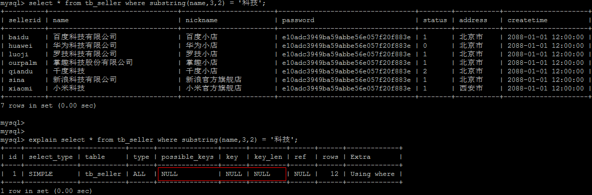
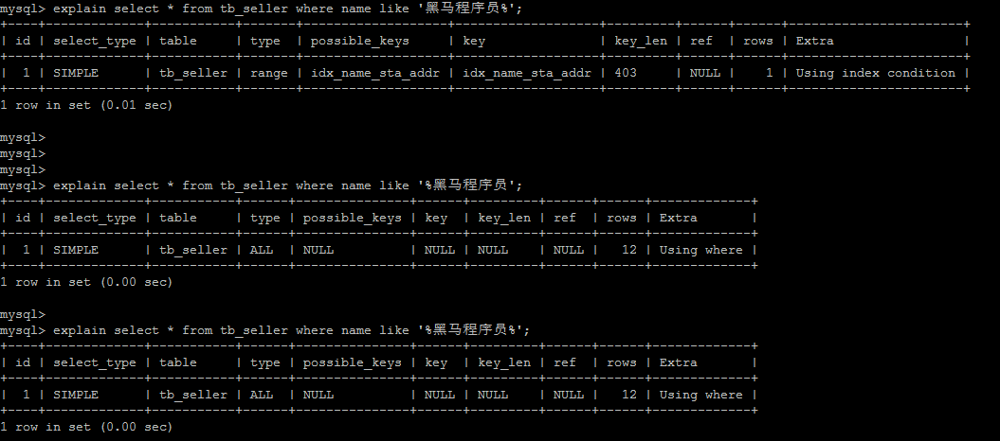

# 索引的使用
索引是数据库优化最常用也是最重要的手段之一，通过索引通常可以帮助用户解决大多数的MySQL的性能优化问题。

## 验证索引提升查询效率
在表结构tb_item中，一共存储300万记录；

A.根据ID查询
```sql
select * from tb_item where id = 1999;
```


查询速度很快，接近0s，主要原因是因为id为主键，有索引；


B.根据title进行精确查询
```sql
select * from tb_item where title = 'iphoneX 移动3G 32G941';
```


查看SQL语句的执行计划：


处理方案，针对title字段，创建索引：

```sql
create index idx_item_title on tb_item(title);
```


索引创建完成后，再次进行查询：


通过explain，查看执行计划，执行SQL时使用了刚才创建的索引


## 使用索引
### 准备环境
```sql
create table `tb_seller` (
	`sellerid` varchar (100),
	`name` varchar (100),
	`nickname` varchar (50),
	`password` varchar (60),
	`status` varchar (1),
	`address` varchar (100),
	`createtime` datetime,
    primary key(`sellerid`)
)engine=innodb default charset=utf8mb4;

insert into `tb_seller` (`sellerid`, `name`, `nickname`, `password`, `status`, `address`, `createtime`) values('alibaba','阿里巴巴','阿里小店','e10adc3949ba59abbe56e057f20f883e','1','北京市','2088-01-01 12:00:00');
insert into `tb_seller` (`sellerid`, `name`, `nickname`, `password`, `status`, `address`, `createtime`) values('baidu','百度科技有限公司','百度小店','e10adc3949ba59abbe56e057f20f883e','1','北京市','2088-01-01 12:00:00');
insert into `tb_seller` (`sellerid`, `name`, `nickname`, `password`, `status`, `address`, `createtime`) values('huawei','华为科技有限公司','华为小店','e10adc3949ba59abbe56e057f20f883e','0','北京市','2088-01-01 12:00:00');
insert into `tb_seller` (`sellerid`, `name`, `nickname`, `password`, `status`, `address`, `createtime`) values('itcast','传智播客教育科技有限公司','传智播客','e10adc3949ba59abbe56e057f20f883e','1','北京市','2088-01-01 12:00:00');
insert into `tb_seller` (`sellerid`, `name`, `nickname`, `password`, `status`, `address`, `createtime`) values('itheima','黑马程序员','黑马程序员','e10adc3949ba59abbe56e057f20f883e','0','北京市','2088-01-01 12:00:00');
insert into `tb_seller` (`sellerid`, `name`, `nickname`, `password`, `status`, `address`, `createtime`) values('luoji','罗技科技有限公司','罗技小店','e10adc3949ba59abbe56e057f20f883e','1','北京市','2088-01-01 12:00:00');
insert into `tb_seller` (`sellerid`, `name`, `nickname`, `password`, `status`, `address`, `createtime`) values('oppo','OPPO科技有限公司','OPPO官方旗舰店','e10adc3949ba59abbe56e057f20f883e','0','北京市','2088-01-01 12:00:00');
insert into `tb_seller` (`sellerid`, `name`, `nickname`, `password`, `status`, `address`, `createtime`) values('ourpalm','掌趣科技股份有限公司','掌趣小店','e10adc3949ba59abbe56e057f20f883e','1','北京市','2088-01-01 12:00:00');
insert into `tb_seller` (`sellerid`, `name`, `nickname`, `password`, `status`, `address`, `createtime`) values('qiandu','千度科技','千度小店','e10adc3949ba59abbe56e057f20f883e','2','北京市','2088-01-01 12:00:00');
insert into `tb_seller` (`sellerid`, `name`, `nickname`, `password`, `status`, `address`, `createtime`) values('sina','新浪科技有限公司','新浪官方旗舰店','e10adc3949ba59abbe56e057f20f883e','1','北京市','2088-01-01 12:00:00');
insert into `tb_seller` (`sellerid`, `name`, `nickname`, `password`, `status`, `address`, `createtime`) values('xiaomi','小米科技','小米官方旗舰店','e10adc3949ba59abbe56e057f20f883e','1','西安市','2088-01-01 12:00:00');
insert into `tb_seller` (`sellerid`, `name`, `nickname`, `password`, `status`, `address`, `createtime`) values('yijia','宜家家居','宜家家居旗舰店','e10adc3949ba59abbe56e057f20f883e','1','北京市','2088-01-01 12:00:00');


create index idx_seller_name_sta_addr on tb_seller(name,status,address);
```

### 避免索引失效

1) 全职匹配，对索引中所有列都指定具体值。该情况下，索引失效，执行效率高。
```sql
explain select * from tb_seller where name='小米科技' and status='1' and address='北京市'；
```

2) 最左前缀法则
如果索引了多列，要遵守最左前缀法则。指的是查询从索引的最左前列开始，并且不跳过索引中的列

匹配最左前缀法则，走索引：


违反最左前缀法则，索引失效：


如果符合最左前缀法则，但是出现跳跃某一列，只有最左列索引生效：


3) 范围查询右边的列，不能使用索引


根据前面的两个字段name，status查询是走索引的，但是最后一个条件address没有用到索引。

4) 不要在索引列上进行运算操作，索引将失效



5) 字符串不加单引号，造成索引失效。


由于在查询时没有对字符串加单引号，MySQL的查询优化器会自动进行类型转换，造成索引失效。

6. 尽量使用覆盖索引，避免select *

  只访问索引的查询(索引列完全包含查询列)


如果查询列，超出索引列，也会降低性能


```
TIP:

    using index ：使用覆盖索引的时候就会出现

    using where ：在查找使用索引的情况下，需要回表去查询所需的数据

    using index condition ：查找使用列索引，但是需要回表查询数据

    using index ; using where ：查找使用了索引，但是需要的数据都在索引列中能找到，索引不需要回表查询数据
```

7) 用or分割开的条件，如果or前的条件中的列有索引，而后面的列中没有索引，那么涉及的索引都不会被用到。
示例：name字段是索引列，而createtime不是索引列，中间是or进行连接是不走索引的
```sql
explain select * from tb_seller where name='黑马程序员' or createtime='2088-01-01 12:00:00';
```


8) 以%开头的Like模糊查询，索引失效
如果仅仅是尾部模糊匹配，索引不会失效。如果是头部模糊匹配，索引失效。



解决方案：
通过覆盖索引来解决(走索引全表扫描)


9) 如果MySQL评估使用索引比全表更慢，则不使用索引。


10) is NULL ， is NOT NULL 有时索引失效。


11) in走索引，not in 索引失效。


#### in 与 not in，exists 与 not exists 的区别以及性能分析
* in和exists
in是把外表和内表作hash连接，而exists是对外表作loop循环，每次loop循环再对内表进行查询，一直以来认为exists比in效率高的说法是不准确的。
如果查询的两个表大小相当，那么用in和exists差别不大；如果两个表中一个较小一个较大，则子查询表大的用exists，子查询表小的用in；
例如：表A(小表)，表B(大表)
```sql
# 效率低，用到了A表上cc列的索引
select * from A where cc in (select cc from B);

# 效率高，用到列B表上cc列的索引。
select * from A where exists (select cc from B where cc=A.cc);
```

相反：
```sql
# 效率高，用到了B表上cc列的索引
select * from B where cc in (select cc from A);

# 效率低，用到列A表上cc列的索引
select * from B where exists (select cc from A where cc=B.cc);
```

* not in和not exists
not in 逻辑上不完全等同于not exists，如果误用了not in，小心存在致命BUG，例：

```sql
create table t1(c1 int,c2 int);

create table t2(c1 int,c2 int);

insert into t1 values(1,2);

insert into t1 values(1,3);

insert into t2 values(1,2);

insert into t2 values(1,null);

# 执行结果：无
select * from t1 where c2 not in (select c2 from t2);

# 执行结果: 1  3
select * from t1 where not exists (select 1 from t2 where t2.c2=t1.c2);
```

1. 对于`not exists`查询，内表存在空值对查询结果没有影响；对于`not in`查询，内表存在空值将导致最终的查询结果为空。
2. 对于`not exists`查询，外表存在空值，存在控制的那条记录最终会输出；对于`not in`查询，外表存在空值，存在空值的那条记录最终将被过滤，其他数据不受影响。

对于 in 和 exists 的性能区别：
如果子查询得出的结果集记录较少，主查询中的表较大且又有索引时应该用in，反之如果外层的主查询记录较少，子查询中的表大，又有索引时使用exists。

12) 单列索引和复合索引。
尽量使用复合索引，而少使用单列索引。
创建复合索引
```sql
create index idx_name_sta_address on tb_seller(name,status,address);

# 相当于创建三个索引：
# name
# name + status
# name + status + address
```

创建单列索引
```sql
create index idx_seller_name on tb_seller(name);

create index idx_seller_status on tb_seller(status);

create index idx_seller_address on tb_seller(address);
```
数据库会选择一个最优的索引(辨识度最高索引)来使用，并不会使用全部索引。

## 查看索引使用情况
```sql
show status like 'Handler_read%';

show global status like 'Handler_read%';
```


```
Handler_read_first: 索引中第一条被读的次数。如果较高，表示服务器正执行大量全索引扫描(值越低越好);

Handler_read_key: 如果索引正在工作，这个值代表一个行被索引值读的次数，如果值越低，表示索引得到的性能改善不高，因为索引不经常使用(值越高越好)。

Handler_read_next: 按照键顺序读下一行的请求数。如果用范围约束或如果执行索引扫描来查询索引列，该值增加。

Handler_read_prev: 按照键顺序读前一行的请求数。该读方法主要用于优化ORDER BY ... DESC。

Handler_read_rnd: 根据固定位置读一行的请求数。如果正执行大量查询并需要对结果进行排序该值较高。可能使用了大量需要MySQL扫描整个表的查询或你的连接没有正确使用键。这个值较高，意味着运行效率低，应该建立索引来补救。

Handler_read_rnd_next: 在数据文件中读下一行的请求数。如果正进行大量的表扫描，该值较高。通常说明表索引不正确或写入的查询没有利用索引
```