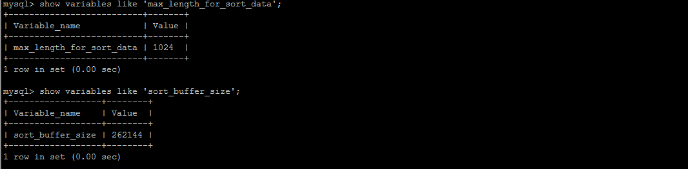
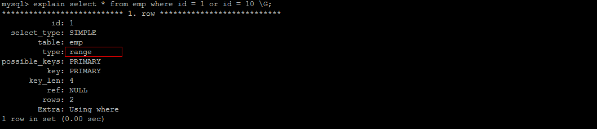
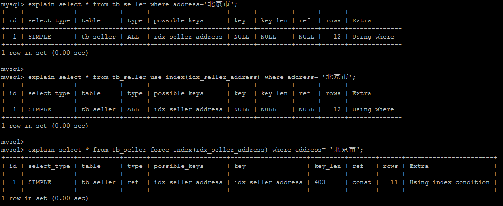

# SQL优化

## 大批量插入数据

环境准备：
```sql
CREATE TABLE `tb_user_2` (
  `id` int(11) NOT NULL AUTO_INCREMENT,
  `username` varchar(45) NOT NULL,
  `password` varchar(96) NOT NULL,
  `name` varchar(45) NOT NULL,
  `birthday` datetime DEFAULT NULL,
  `sex` char(1) DEFAULT NULL,
  `email` varchar(45) DEFAULT NULL,
  `phone` varchar(45) DEFAULT NULL,
  `qq` varchar(32) DEFAULT NULL,
  `status` varchar(32) NOT NULL COMMENT '用户状态',
  `create_time` datetime NOT NULL,
  `update_time` datetime DEFAULT NULL,
  PRIMARY KEY (`id`),
  UNIQUE KEY `unique_user_username` (`username`)
) ENGINE=InnoDB DEFAULT CHARSET=utf8 ;
```

当使用load命令导入数据时，适当的设置可以提高导入的效率
```sql
load data local infile 'E:/sql1.log' into table tb_user_2 fields terminated by ',' lines terminated by '\n';

load data local infile 'E:/sql2.log' into table tb_user_2 fields terminated by ',' lines terminated by '\n';
```

对于InnoDB类型的表，有以下几种方式可以提高导入的效率：

* 主键顺序插入

因为InnoDB类型的表是按照主键的顺序保存的，所以将导入的数据按照主键的顺序排列，可以有效的提高导入数据的效率。

如果InnoDB表没有主键，那么系统会自动默认创建一个内部列作为主键。

```text
脚本文件介绍 :
	sql1.log  ----> 主键有序
	sql2.log  ----> 主键无序
```

插入ID顺序排列数据：


插入ID无序排列数据：


* 关闭唯一性校验

在导入数据前执行 SET UNIQUE_CHECKS=0，关闭唯一性校验。
在导入结束后执行 SET UNIQUE_CHECKS=1，恢复唯一性校验，可以提高导入的效率。


* 手动提交事务

如果应用使用自动提交的方式，建议在导入前执行 SET AUTOCOMMIT=0，关闭自动提交，导入结束后再执行 SET AUTOCOMMIT=1，打开自动提交，也可以提高导入的效率。


## 优化insert语句

当进行数据的insert操作时，可以考虑采用以下几种优化方案。

* 如果需要同时对一张表插入很多数据时，应该尽量使用多个值表的insert语句，这种方式将大大缩减客户端与数据库之间的连接、关闭等消耗。

原始方式：
```sql
insert into tb_test values(1,'Tom');
insert into tb_test values(2,'Cat');
insert into tb_test values(3,'Jerry');
```

优化后：
```sql
insert into tb_test values(1,'Tom'),(2,'Cat')，(3,'Jerry');
```

* 在事务中进行数据插入

```sql
start transaction;
insert into tb_test values(1,'Tom');
insert into tb_test values(2,'Cat');
insert into tb_test values(3,'Jerry');
commit;
```

* 数据有序插入

原始方式：
```sql
insert into tb_test values(4,'Tim');
insert into tb_test values(1,'Tom');
insert into tb_test values(3,'Jerry');
insert into tb_test values(5,'Rose');
insert into tb_test values(2,'Cat');
```

优化后：
```sql
insert into tb_test values(1,'Tom');
insert into tb_test values(2,'Cat');
insert into tb_test values(3,'Jerry');
insert into tb_test values(4,'Tim');
insert into tb_test values(5,'Rose');
```

## 优化order by语句

### 环境准备
```sql
CREATE TABLE `emp2` (
  `id` int(11) NOT NULL AUTO_INCREMENT,
  `name` varchar(100) NOT NULL,
  `age` int(3) NOT NULL,
  `salary` int(11) DEFAULT NULL,
  PRIMARY KEY (`id`)
) ENGINE=InnoDB  DEFAULT CHARSET=utf8mb4;

insert into `emp2` (`id`, `name`, `age`, `salary`) values('1','Tom','25','2300');
insert into `emp2` (`id`, `name`, `age`, `salary`) values('2','Jerry','30','3500');
insert into `emp2` (`id`, `name`, `age`, `salary`) values('3','Luci','25','2800');
insert into `emp2` (`id`, `name`, `age`, `salary`) values('4','Jay','36','3500');
insert into `emp2` (`id`, `name`, `age`, `salary`) values('5','Tom2','21','2200');
insert into `emp2` (`id`, `name`, `age`, `salary`) values('6','Jerry2','31','3300');
insert into `emp2` (`id`, `name`, `age`, `salary`) values('7','Luci2','26','2700');
insert into `emp2` (`id`, `name`, `age`, `salary`) values('8','Jay2','33','3500');
insert into `emp2` (`id`, `name`, `age`, `salary`) values('9','Tom3','23','2400');
insert into `emp2` (`id`, `name`, `age`, `salary`) values('10','Jerry3','32','3100');
insert into `emp2` (`id`, `name`, `age`, `salary`) values('11','Luci3','26','2900');
insert into `emp2` (`id`, `name`, `age`, `salary`) values('12','Jay3','37','4500');

create index idx_emp_age_salary on emp2(age,salary);
```

### 两种排序方式

1. 通过对返回数据进行排序(FileSort排序)，所有不是通过索引直接返回排序结果对排序都为`FileSort`排序。


2. 通过有序索引顺序扫描直接返回有序数据，这种情况为`using index`，不需要额外排序，操作效率高。


多字段排序


排序方式 优化目标：
尽量减少额外的排序，通过索引直接返回有序数据。
where条件和order by 使用相同的索引，并且order by 的顺序和索引顺序相同，并且order by 的字段都是生序，或者都是降序。
否则肯定需要额外的操作，这样就会出现FileSort

### FileSort优化

通过创建合适的索引，能够减少 FileSort 的出现，但在某些情况下，条件限制不能让 FileSort 消失，那就需要加快 FileSort 的排序操作。
对于FileSort，MySQL有两种排序算法：
1. 两次扫描算法： 
MySQL4.1之前，使用该方式排序。首先根据条件取出排序字段和行指针信息，然后在排序区 sort buffer 中排序，如果sort buffer 不够，则在临时表temporary table 中存储排序结果。
完成排序后，再根据指针回表读取记录，该操作可能会导致大量随机I/O操作。
2. 一次扫描算法：
一次性读取满足条件的所有字段，然后在排序区 sort buffer 中排序后直接输出结果集。
排序时内存开销较大，但是排序效率比两次扫描算法要高。



### 优化group by语句

由于group by实际上也同样会进行排序操作，而且与order by相比，group by主要只是多列排序之后的分组操作。
如果在分组的时候还使用列其他的一些聚合函数，那么还需要一些聚合函数的计算。
所以，在group by的实现过程中，与order by一样也可以利用到索引。

如果查询包含group by ，但用户想要避免排序结果的消耗，则可以执行order by null禁止排序。
```sql
drop index idx_emp_age_salary on emp2;

explain select age,count(*) from emp2 group by age;
```


优化后：
```sql
explain select age,count(*) from emp group by age order by null;
```


从上面列子看出，第一个SQL语句需要进行"FileSort"，而第二个SQL由于order by null不需要进行"FileSort"，而上文提过FileSort往往非常耗费时间。

创建索引：
```sql
create index idx_emp_age_salary on emp(age,salary)；
```


### 优化嵌套查询
Mysql4.1版本之后，开始支持SQL的子查询。这个技术可以使用SELECT语句来创建一个单列的查询结果，然后把这个结果作为过滤条件用在另一个查询中。
使用子查询可以一次性的完成很多逻辑上需要多个步骤才能完成的SQL操作，同时也可以避免事务或者表锁死，并且写起来也很容易。
但是，有些情况下，子查询是可以被更高效的连接(JOIN)替代。

示例，查找有角色的所有的用户信息：
```sql
 explain select * from t_user where id in (select user_id from user_role );
```

执行计划为：


优化后：
```sql
explain select * from t_user u , user_role ur where u.id = ur.user_id;
```


连接(JOIN)查询之所以更有效率一些，是因为MySQL不需要在内存中创建临时表来完成这个逻辑上需要两个步骤的查询工作。

### 优化OR条件
对于包含OR的查询子句，如果要利用索引，则OR之间的每个条件列都必须用到索引，而且不能使用到复合索引；如果没有索引，则应该考虑增加索引。

获取 emp 表中的所有的索引：


示例：
```sql
explain select * from emp where id = 1 or age = 30;
```




建议使用union替换or：


我们来比较下重要指标，发现主要差别是type和ref这两项

type显示的是访问类型，是较为重要的一个指标，结果值从好到坏依次是：
```sql
system > const > eq_ref > ref > fulltext > ref_or_null  > index_merge > unique_subquery > index_subquery > range > index > ALL
```

UNION语句的type值为ref，OR语句的type值为range，可以看到这是一个很明显的差距

UNION语句的ref值为const，OR语句的type值为null，const表示是常量值引用，非常快

这两项的差距就说明了UNION要优于OR。

### 优化分页查询
一般分页查询时，通过创建覆盖索引能够比较好地提高性能。一个常见又非常头疼的问题就是limit 20000000，10
此时需要MySQL排序前2000010记录，仅仅返回2000000-2000010的记录，吉他记录丢弃，查询排序的代价非常大。


* 优化思路一
在索引上完成排序分页操作，最后根据主键关联回原表查询所需要的其他列内容

* 优化思路二
该方案适用于主键自增的表，可以把Limit查询转换成某个位置的查询


### 使用SQL提示
SQL提示，在SQL语句中加入一些认为的提示来达到优化操作的目的

#### USE INDEX
在查询语句中表名的后面，添加 use index 来提供希望MySQL区参考的索引列表
```sql
create index idx_seller_name on tb_seller(name);
```


#### IGNORE INDEX
如果用户只是单纯想让MySQL忽略一个或多个索引，则可以使用 ignore index 作为 hint
```sql
 explain select * from tb_seller ignore index(idx_seller_name) where name = '小米科技';
```


#### FORCE INDEX
为强制MySQL使用一个特定的索引，可在查询中使用 force index 作为 hint
```sql
create index idx_seller_address on tb_seller(address);
```


